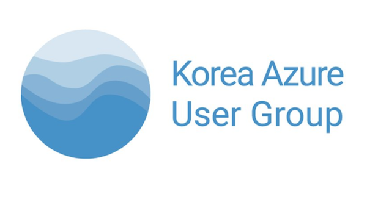
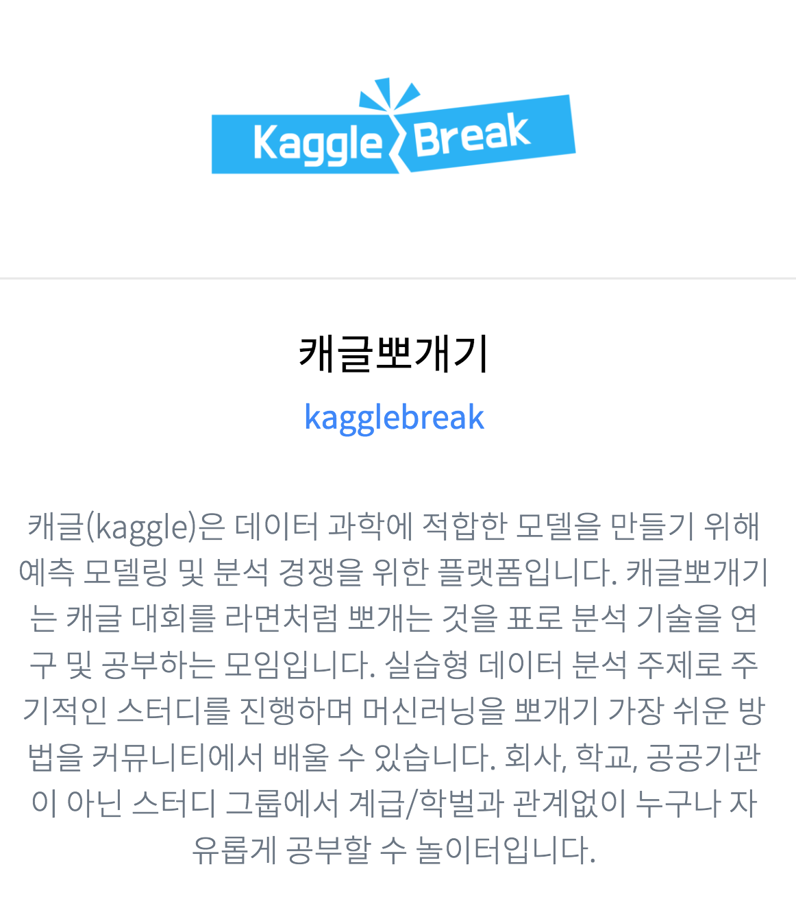

# Saturday Azure live! 1809

## “Azure X Kaggle : 미국 택시요금 싸게 내는 법”

{:.some-css-class style="width: 200px"}

- 일시 : 2018년 9월 15일, 시간 오후 1시 ~ 오후 6시
- 장소 : 강남 토즈 (미정)
- 링크 : Fesat

## 캐글뽀개기 스터디 : https://www.facebook.com/groups/kagglebreak

{:.some-css-class style="width: 200px"}

========================================================
 

| 발표 시간  | 튜토리얼 내용 | 발표자료 |
| :------------ | :-----------: | :-----------: |
| 12:30   | 참가자 등록 및 확인||
| 13:00 ~ 14:00   | (첫 번째 시간) 캐글 및 데이터 분석 소개|[발표자료]()|
| 16:40 ~ 17:50   | (두 번째 시간) R + Tidyverse + Boosting |[발표자료]()|
| 15:30 ~ 15:50   | 쉬는 시간||
| 15:50 ~ 17:20   | (세 번째 시간) Taxi Fare Prediction 대회 소개 및 탐색적 데이터 분석 |[발표자료]()|
| 17:20 ~ 18:00   | (네 번째 시간) Taxi Fare Prediction 모델 개발 및 제출 |[발표자료]()|

## 자료 링크
- 자료는 html로 다운로드 받아서 보시는게 좋습니다. 링크로는 Rmd 파일 연결해두었습니다.
- 실습의 해당되는 코드는 github 및 링크를 통해 공유드립니다. 
github을 clone 또는 download 해주시면 됩니다.
- 워킹캐글(캐글뽀개기 스터디 이름) Github : [Tutorial Github](https://github.com/KaggleBreak/walkingkaggle)
