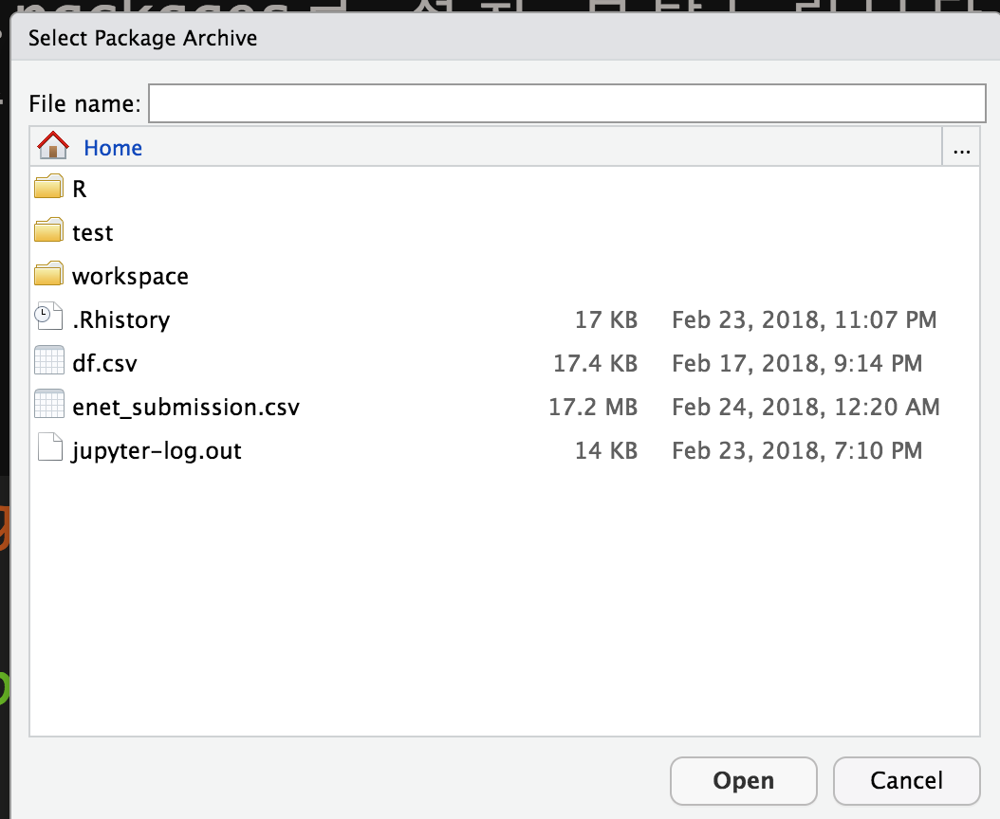
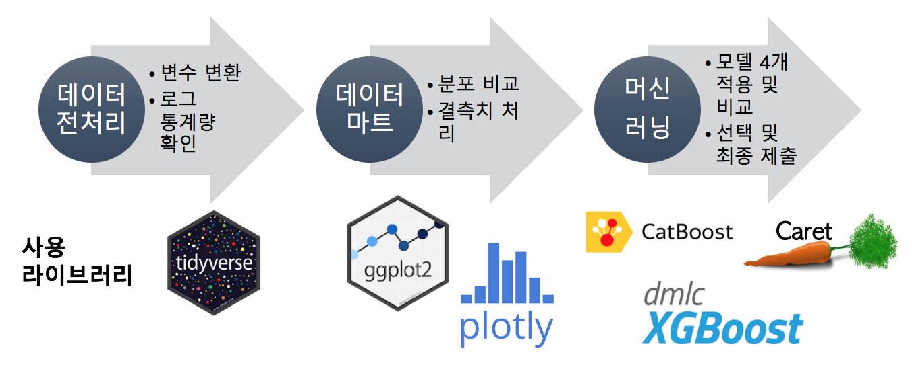
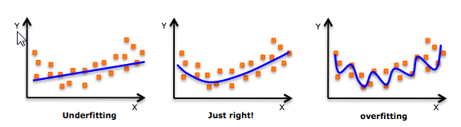
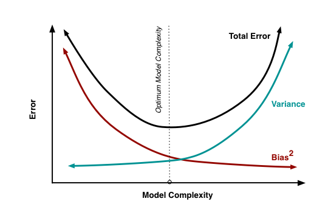
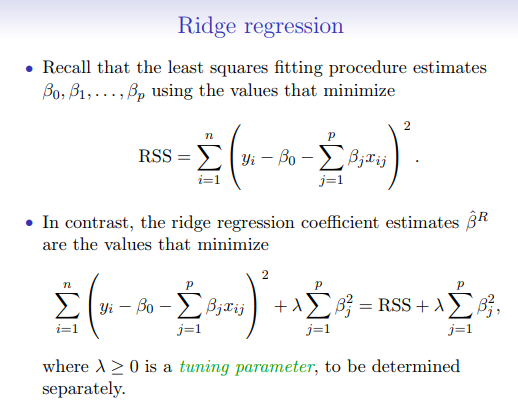
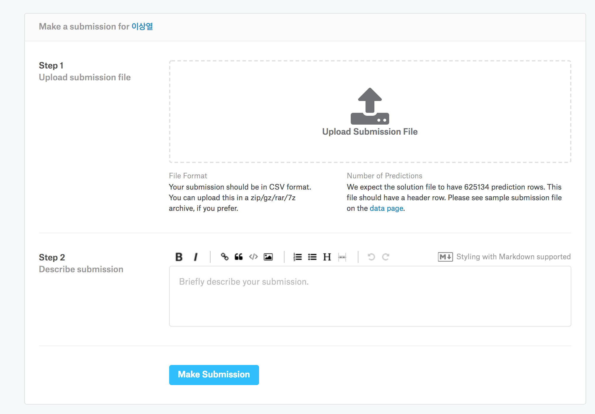
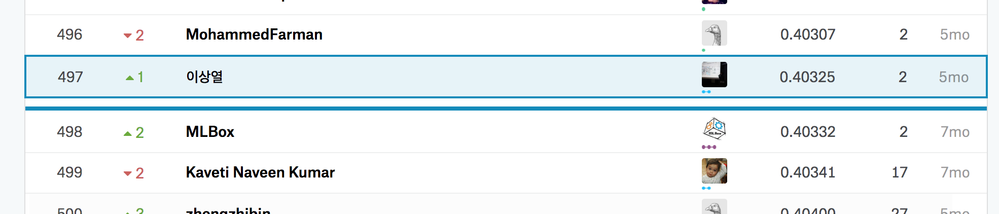

```{r setup, include=FALSE}
knitr::opts_chunk$set(echo = TRUE)
```

# KCD 2018 
## 타이디(tidyverse)와 당근(caret)으로 캐글(kaggle) 입문하기 튜토리얼


### 일시 : 2018년 2월 24일, 시간 오후 3시20분 ~ 오후 5시50분
### 장소 : 한국Microsoft 11층(광화문 더케이트윈타워 A동)
### 링크 : https://kcd2018.festa.io/

<br>


### 캐글뽀개기 스터디 : https://www.facebook.com/groups/kagglebreak


### 목차
| 발표 시간  | 튜토리얼 내용 | 
| :------------ | :-----------: | 
| 15:20 ~ 16:20    | (첫 번째 시간) 캐글 및 세팅
| 16:40 ~ 17:50   | (두 번째 시간) 문제 풀어보기 | 

- 이번 시간부터 캐글 문제 풀어보기가 진행될 예정입니다. 1. 데이터 전처리, 2. 탐색적 데이터 분석, 3. 머신러닝, 4. 제출 등입니다.

### 데이터 필드

- id : 각 출장의 고유 식별자
- vendor_id : 여행 기록과 연결된 공급자를 나타내는 코드
- pickup_datetime : 미터가 작동 된 날짜와 시간
- dropoff_datetime : 미터가 분리 된 날짜와 시간
- passenger_count : 차량의 승객 수 (운전자가 입력 한 값)
- pickup_longitude : 미터가 사용 된 경도
- pickup_latitude : 미터가 사용 된 위도
- dropoff_longitude : 미터가 분리 된 경도
- dropoff_latitude : 미터가 분리 된 위도
- store_and_fwd_flag : 플래그는 자동차가 서버에 연결되어 있지 않아 여행 기록이 차량 메모리에 보관되었는지 여부를 나타냅니다. 
  - Y = 저장 및 전달; N = 상점 및 순회 여행 불가

- trip_duration : 여행 기간 (초)


## 1단계. 데이터 전처리 (1)

- 머신러닝에 사용할 패키지만 불러오겠습니다. 만약 패키지 설치가 안되었다고 한다면 install.packages() 명령어로 설치 부탁드립니다.
  - 보내드린 usb 안에 압축 파일로 인터넷 접속 없이 패키지 설치도 가능합니다. Rstudiols -> tools -> install.packages -> install from을 cran에서 package archive file로 바꾸고 설치하고 싶은 패키지 tar.gz 파일을 누르시길 바랍니다.
   
  

 

- 일반적으로 위 흐름과 같이 머신러닝 절차를 밟을 수 있습니다.
- tidyverse -> ggplot2 -> plotly -> Caret -> xgboost, catbosot, glmnet

```{r, echo = TRUE, message=FALSE}
#라이브러리 로딩
setwd("/home/kaggle/workspace/walkingkaggle/kcd2018")
set.seed(2310)

require(DT)
require(tidyverse)
require(geosphere)
require(caret)
require(lubridate)
require(data.table)
require(corrplot)
#require(gbm)

train = read_csv("./data/nyc-taxi-trip-duration/train.csv")
test = read_csv("./data/nyc-taxi-trip-duration/test.csv")

pick_coord <- train %>%
  select(pickup_longitude, pickup_latitude)
drop_coord <- train %>%
  select(dropoff_longitude, dropoff_latitude)
```


## 1단계. 데이터 전처리 (2)

- 이번 튜토리얼에서는 기본적인 데이터 전처리만 할 예정입니다.
  - 주로 시간 변수를 만들어내고, 좌표계를 이용하여 distance를 계산할 예정입니다.

```{r}
train <- train %>%
  mutate(pickup_datetime = ymd_hms(pickup_datetime),
         pickup_months = month(pickup_datetime),
         pickup_week = week(pickup_datetime),
         pickup_yday = yday(pickup_datetime),
         pickup_wday = wday(pickup_datetime),
         pickup_day = day(pickup_datetime),
         pickup_hour = hour(pickup_datetime),
         pickup_min = minute(pickup_datetime),
         vendor_id = factor(vendor_id),
         passenger_count = factor(passenger_count),
         pickup_second = second(pickup_datetime),
          dropoff_longitude_outlier = ifelse(dropoff_longitude > quantile(dropoff_longitude, 0.95)[[1]], 1, 0),
         dropoff_latitude_outlier = ifelse(dropoff_longitude > quantile(dropoff_latitude, 0.95)[[1]], 1, 0),
         pickup_longitude_outlier = ifelse(dropoff_longitude > quantile(pickup_longitude, 0.95)[[1]], 1, 0),
         pickup_latitude_outlier = ifelse(dropoff_longitude > quantile(pickup_latitude, 0.95)[[1]], 1, 0)
)


train$dist_Cosine <- distCosine(pick_coord, drop_coord) 
train$dist_Haversine <- distHaversine(pick_coord, drop_coord) 
```

- 'haversine method'에 따라 두 점 사이의 최단 거리 (즉, '원 - 원 거리'). 해당 방법은 타원 효과를 무시하고 구형의 지구를 가정합니다.


## 2단계. 데이터 시각화 (1)

- haversine 거리 시각화 (x/y축 로그스케일 변환)

```{r}
ggplot(data=train, aes(x= dist_Haversine)) + 
  geom_histogram() +
  scale_x_log10() +
  scale_y_log10() +
  theme_bw() +
  theme(axis.title = element_text(size=16),
        axis.text = element_text(size=14)) +
  labs(x = 'Distance', y = 'Count', title = 'Distance') +
  theme_bw()
```

- haversine 거리 시각화 (x/y축 로그스케일 변환)
- 거리와 여행 시간 간에는 당연히 상관관계가 높을 수밖에 없습니다. 산점도를 확인하는 방법은 다양한데 여기에서는 기본적인 방법만 보여드립니다.
- 대용량 산점도는 smoothscatter in r 를 참고하시면 됩니다.

```{r}
ggplot(train) +
  geom_point(aes(x=dist_Haversine,y=trip_duration))+
  scale_y_log10() +
  scale_x_log10() +
  theme_bw()+
  theme(axis.title = element_text(size=16),axis.text = element_text(size=14))+
  xlab("(Distance)")+
  ylab("Duration")
```


- longitude(경도) 분포입니다. 일부 이상치가 보입니다.

```{r}
ggplot(data=train, aes(x= pickup_longitude)) + 
  geom_histogram(bins = 100) +
  scale_x_continuous(limits = c(-74,-73.85)) +
  theme_bw() +
  theme(axis.title = element_text(size=16),
        axis.text = element_text(size=14)) +
  labs(x = 'Longitude', y = 'Count', title = 'Longitude')
```

- latitude(위도) 분포입니다. 정규 분포는 아니겠지만 경도보다는 좀더 모여있네요.

```{r}
ggplot(data=train, aes(x= pickup_latitude)) + 
  geom_histogram(bins = 100) +
  scale_x_continuous(limits = c(40.6,40.85)) +
  theme_bw() +
  theme(axis.title = element_text(size=16),
        axis.text = element_text(size=14)) +
  labs(x = 'Latitude', y = 'Count', title = 'Latitude')
```

- 특정 날짜에 데이터가 적은 것(이가 빠진 부분)을 봤을 때는 집계 상의 문제일 가능성이 높습니다.

```{r}
p1 <- train %>%
  ggplot(aes(pickup_datetime)) +
  geom_histogram(fill = "red", bins = 120) +
  labs(x = "Pickup dates") + theme_bw()
p2 <- train %>%
  ggplot(aes(dropoff_datetime)) +
  geom_histogram(fill = "blue", bins = 120) +
  labs(x = "Dropoff dates") + theme_bw()

p1
p2
```


- 플래그는 자동차가 서버에 연결되어 있지 않아 여행 기록이 차량 메모리에 보관되었는지 여부를 나타냅니다. 
  - Y = 저장 및 전달; N = 상점 및 순회 여행 불가
- vendor_id : 여행 기록과 연결된 공급자를 나타내는 코드 

```{r}
p3 <- train %>%
  ggplot(aes(store_and_fwd_flag)) +
  geom_bar() +
  theme(legend.position = "none") +
  scale_y_log10() + theme_bw()

p4 <- train %>%
  ggplot(aes(vendor_id, fill = vendor_id)) +
  geom_bar() +
  theme(legend.position = "none") + theme_bw()

p3
p4
```

- 요일에 따라 여행 시간의 중앙 값에는 차이가 있습니다. (벤더 id도 일부 영향이 있습니다)
- 시간에 따라 여행 시간의 중앙 값에는 차이가 있습니다. 

```{r}
p5 <- train %>%
  group_by(pickup_wday, vendor_id) %>%
  summarise(median_duration = median(trip_duration)/60) %>%
  ggplot(aes(pickup_wday, median_duration, color = vendor_id)) +
  geom_point(size = 4) +
  labs(x = "Day of the week", y = "Median trip duration [min]") + theme_bw()

p6 <- train %>%
  group_by(pickup_hour, vendor_id) %>%
  summarise(median_duration = median(trip_duration)/60) %>%
  ggplot(aes(pickup_hour, median_duration, color = vendor_id)) +
  geom_smooth(method = "loess", span = 1/2) +
  geom_point(size = 4) +
  labs(x = "Hour of the day", y = "Median trip duration [min]") +
  theme(legend.position = "none") + theme_bw()

p5
p6
```

- 더 자주 여행하는 벤더 2는 지속적으로 더 높은 여행 기간을 가집니다.

```{r}
train.datatable = as.data.table(train)
train.datatable <- train.datatable[,distance_km :=    distHaversine(matrix(c(pickup_longitude, pickup_latitude), ncol = 2),       matrix(c(dropoff_longitude,dropoff_latitude), ncol = 2))/1000]

train.datatable[,speed:=(distance_km)/(trip_duration/3600)]
train.datatable %>% 
  ggplot(aes(x=speed)) + 
  geom_histogram(bins=4000, fill="red")+
  theme_bw()+theme(axis.title = element_text(size=11),axis.text = element_text(size=8))+
  ylab("Density")+coord_cartesian(x=c(0,50)) + theme_bw()
```

- 테스트 속도는 테스트 데이터 세트에서 사용할 수 없습니다. 그러나 그것은 어떤 종류의 패턴이 트래픽에 있는지를 보는 것을 도울 수 있습니다.

```{r}
summary(train.datatable$speed)
```

- 9285km / h 속도의 특정 rides가 있습니다. 이상치 (Outlier Analysis)가 있음. 그러나 평균 속도는 15km / h입니다.


```{r}
train.datatable %>% 
  group_by(pickup_hour) %>% 
  summarize(mean_speed = mean(speed),n()) %>% 
  ggplot(aes(x=pickup_hour,y=mean_speed))+
  geom_smooth(method = 'loess',color="grey10")+
  geom_point(color="red")+coord_cartesian(ylim=c(10,25))+ theme_bw()
```

- 하루 평균 속도가 상당히 낮습니다. 분명히 트래픽이 많기 때문입니다.

```{r}
corr_features = train.datatable[,.(pickup_longitude,pickup_latitude,dropoff_longitude,dropoff_latitude,  pickup_hour, pickup_week, pickup_months,pickup_yday,pickup_wday,pickup_day, pickup_yday,trip_duration,distance_km)]

corrplot(cor(corr_features, use='complete.obs'), type='lower')
```

- 변수의 어느 것도 trip_duration과 상관 관계가 없기 때문에 이것은 매우 불안정한 구성입니다.

- 거리가 상관 관계가 있는 유일한 거리이지만 테스트 세트에는 해당 기능이 없습니다. 기능의 일부가 대상 변수와 상호 연관 될 수도 있지만 조사해야 합니다.

- 피쳐와 타겟 변수간에 상관 관계가 없다는 것은 트립 시간을 예측하기 위해 외부 피쳐를 찾아야할 수도 있습니다.


## 3단계. 머신러닝 (1)

- 모델 생성을 위해 Train/Test 데이터를 전처리 할 예정입니다.
- y값은  Root Mean Squared Logarithmic Error(평가 함수)로 인하여 log 처리하고 캐릭터 변수는 숫자로 모두 변환할 예정입니다.

```{r}
train$log_trip_duration = log(train$trip_duration + 1)

transformdata = train %>% 
  select(-c(dropoff_datetime,
            pickup_datetime,id,
            trip_duration))

features <- colnames(transformdata)

for (f in features) {
  if ((class(transformdata[[f]])=="factor") || (class(transformdata[[f]])=="character")) {
    levels <- unique(transformdata[[f]])
    transformdata[[f]] <- as.numeric(factor(transformdata[[f]], levels=levels))
  }
}
```

- 훈련 데이터만 전처리 했기 때문에 똑같은 방식으로 테스트 데이터도 전처리 해야 됩니다.

```{r}
pick_coord <- test %>%
  select(pickup_longitude, pickup_latitude)
drop_coord <- test %>%
  select(dropoff_longitude, dropoff_latitude)

test <- test %>%
  mutate(pickup_datetime = ymd_hms(pickup_datetime),
         pickup_months = month(pickup_datetime),
         pickup_week = week(pickup_datetime),
         pickup_yday = yday(pickup_datetime),
         pickup_wday = wday(pickup_datetime),
         pickup_day = day(pickup_datetime),
         pickup_hour = hour(pickup_datetime),
         pickup_min = minute(pickup_datetime),
         vendor_id = factor(vendor_id),
         passenger_count = factor(passenger_count),
         pickup_second = second(pickup_datetime),
         dropoff_longitude_outlier = ifelse(dropoff_longitude > quantile(dropoff_longitude, 0.95)[[1]], 1, 0),
         dropoff_latitude_outlier = ifelse(dropoff_longitude > quantile(dropoff_latitude, 0.95)[[1]], 1, 0),
         pickup_longitude_outlier = ifelse(dropoff_longitude > quantile(pickup_longitude, 0.95)[[1]], 1, 0),
         pickup_latitude_outlier = ifelse(dropoff_longitude > quantile(pickup_latitude, 0.95)[[1]], 1, 0)
  )


test$dist_Cosine <- distCosine(pick_coord, drop_coord) 
test$dist_Haversine <- distHaversine(pick_coord, drop_coord) 
```

```{r}
transformTest = test[,-1]

for (f in features) {
  if ((class(transformTest[[f]])=="factor") || (class(transformTest[[f]])=="character")) {
    levels <- unique(transformTest[[f]])
    transformTest[[f]] <- as.numeric(factor(transformTest[[f]], levels=levels))
  }
}
```


## Caret 이해하기


- caret 패키지의 명칭은 "Classification And REgression Training" 의 앞글자를 따와 명명되었음
- caret 패키지는 예측모델을 만들기 위한 데이터 학습 시 간편한 함수를 제공해줌
- 238개 머신러닝 모델 제공
- [Caret 패키지 전체내용 gitbook](https://topepo.github.io)

### Caret의 특징
- Specifying the Model
- Parallel Processing
- Preprocessing
- Resampling
- Performance Metrics
- Grid Search / Random Search
- Subsampling

## Regularization



- bias와 variance의 balancing error를 찾기 위한 최적의 feature 수를 찾아가는 과정
- 트레인 데이터보다 테스트 데이터의 에러 (generalization error)를 줄이는데 목표
- bias-variance tradeoff에서 variance를 줄이는 방향으로 적용
bias를 크게 하지 않으면서 과적합 방지




## Ridge



- parameter를 축소하여 다중공산성 방지에 쓰임
- 계수 축소에 의해 모델의 복잡도를 줄임
L2 regularization 활용, 계수의 크기의 제곱값에 대해 penalty 부여

## Lasso


- L1 regularization 활용, 계수의 크기의 절대값과 동일한 penalty 부여
변수 선택에 유용


## Elastic Net

- Ridge : 모든 변수 사용, 계수값은 줄이지만 여전희 모든 변수 보유, 모델 성능 저하
- Lasso : correlate한 변수 중 단 한 개의 변수만 선택하고 나머지 변수 계수는 0으로 변환, 정보손실로 인한 정확도 저하
- Elastic Net : Ridge와 Lasso의 Hybrid 방식 (correlate한 다수의 feature 가진 데이터셋에 유리)
- 계수의 절대값의 함과 제곱합을 동시에 penalty값으로 가지는 모형
상관 변수 그룹을 만들고 Y와 강한 상관 관계 있는 변수 속한 그룹의 변수는 모두 선택
- 데이터 셋의 크지 않고 feature 개수가 작을 경우 ridge, lasso 보다 성능 안좋을 경우 생김


### Caret Package 사용
- Ridge / Lasso / Elstic Net에서 최적의 람다값을 찾는 것이 중요
- 시간 관계상 lamda 값은 0, 0.2, 0.4, 0.6, 0.8, 1만 실험

```{r}
inTraining <- createDataPartition(transformdata$log_trip_duration, p = .75, list = FALSE)
training <- transformdata[ inTraining,]
testing  <- transformdata[-inTraining,]

fit_control <- trainControl(method = "cv",
                            number = 5)

lambdas <- seq(1,0,-0.2)
X_train <- training %>% select(-(log_trip_duration))
X_vaild <- testing %>% select(-(log_trip_duration))
y_train <- training$log_trip_duration
y_vaild <- testing$log_trip_duration


#gbm_grid <- expand.grid(n.trees = 100,
#                       interaction.depth = 6,
#                       shrinkage= .01,
#                       n.minobsinnode = 20)

#system.time(model_gbm <- caret::train(log_trip_duration~., 
#                                         data=training,
#                                         method = 'gbm',
#                                         trControl = fit_control,
#                                         tuneGrid = gbm_grid,
#                                         metric = 'RMSE'))
```

## Ridge Model

```{r}
# train model
system.time(model_ridge <- train(x=X_train, y=y_train,
                     method="glmnet",
                     metric="RMSE",
                     maximize=FALSE,
                     trControl=fit_control,
                     tuneGrid=expand.grid(alpha=0, # Ridge regression
                                       lambda=lambdas)))
```

```{r}
ggplot(data=dplyr::filter(model_ridge$result,RMSE>0.6)) + 
    geom_line(aes(x=lambda,y=RMSE)) + theme_bw()

mean(model_ridge$resample$RMSE)
```


## Lasso Model

```{r}
system.time(model_lasso <- train(x=X_train, y=y_train,
                     method="glmnet",
                     metric="RMSE",
                     maximize=FALSE,
                     trControl=fit_control,
                     tuneGrid=expand.grid(alpha=1, # Ridge regression
                                       lambda=lambdas)))
```


```{r}
ggplot(data=dplyr::filter(model_lasso$result,RMSE>0.6)) + 
    geom_line(aes(x=lambda,y=RMSE)) + theme_bw()

mean(model_lasso$resample$RMSE)
```


## Elastic Net Model

```{r}
system.time(model_enet <- train(x=X_train, y=y_train,
                     method="glmnet",
                     metric="RMSE",
                     maximize=FALSE,
                     trControl=fit_control,
                     tuneGrid=expand.grid(alpha=0.5, # elastic net
                                       lambda=lambdas)))
```

```{r}
ggplot(data=dplyr::filter(model_enet$result,RMSE>0.6)) + 
    geom_line(aes(x=lambda,y=RMSE)) + theme_bw()

mean(model_enet$resample$RMSE)
```

## 3개 모델 비교, 모형 성능은 비슷함, Feature Selection 해주는 Elastic Net Model 사용

```{r}
cbind(mean(model_ridge$resample$RMSE),
mean(model_lasso$resample$RMSE),
mean(model_enet$resample$RMSE))
```


## Elastic Net Model Feature 선택 결과

```{r}
coef <- data.frame(coef.name = dimnames(coef(model_lasso$finalModel,s=model_lasso$bestTune$lambda))[[1]], 
           coef.value = matrix(coef(model_lasso$finalModel,s=model_lasso$bestTune$lambda)))
# exclude the (Intercept) term
coef <- coef[-1,]


# extract coefficients for the best performing model
coef_enet <- data.frame(coef_enet.name = dimnames(coef(model_enet$finalModel,s=model_enet$bestTune$lambda))[[1]], 
           coef_enet.value = matrix(coef(model_enet$finalModel,s=model_enet$bestTune$lambda)))
# exclude the (Intercept) term
coef_enet <- coef_enet[-1,]

# print summary of model results
picked_features_enet <- nrow(dplyr::filter(coef_enet,coef_enet.value!=0)) #yk dplyr::filter
enet_features <- dplyr::filter(coef_enet,coef_enet.value!=0)
not_picked_features_enet <- nrow(dplyr::filter(coef_enet,coef_enet.value==0))
cat("Elastic Net picked",picked_features_enet,"variables and eliminated the other",
    not_picked_features_enet,"variables\n")
```

```{r}
# sort coefficients in ascending order
coef_enet <- dplyr::arrange(coef_enet,-coef_enet.value)
imp_coef_enet <- rbind(head(coef_enet,5),
                  tail(coef_enet,5))

ggplot(imp_coef_enet) +
    geom_bar(aes(x=reorder(coef_enet.name,coef_enet.value),y=coef_enet.value),
             stat="identity") +
    ylim(-10,10) +
    coord_flip() +
    ggtitle("Coefficents in the Elastic Net Model") +
    theme(axis.title=element_blank()) + theme_bw()
```


## Lasso Model Feature 선택 결과

```{r}
# print summary of model results
picked_features <- nrow(dplyr::filter(coef,coef.value!=0)) 
lasso_features <- dplyr::filter(coef,coef.value!=0)
not_picked_features <- nrow(dplyr::filter(coef,coef.value==0))
cat("Lasso picked",picked_features,"variables and eliminated the other",
    not_picked_features,"variables\n")

# sort coefficients in ascending order
coef <- dplyr::arrange(coef,-coef.value)
imp_coef <- rbind(head(coef,5),
                  tail(coef,5))

ggplot(imp_coef) +
    geom_bar(aes(x=reorder(coef.name,coef.value),y=coef.value),
             stat="identity") +
    ylim(-10,10) +
    coord_flip() +
    ggtitle("Coefficents in the Lasso Model") +
    theme(axis.title=element_blank()) + theme_bw()
```


## 모델 예측

```{r}
test_preds <- predict(model_enet,newdata=transformTest)
makeToOne = function(preds){
  if(preds < 0){
    return(0.0)
  }  else  {
    return(preds)
  }
}

predictions = sapply(test_preds,makeToOne)
predictions = exp(predictions)
predictionsDF = data.frame(id = test$id, trip_duration =predictions)

write.csv(predictionsDF, file = "./data/nyc-taxi-trip-duration/enet_submission.csv",row.names=FALSE)
```


## 최종 제출



- 제출은 사이트에 직접하거나 캐글 api를 사용할 수도 있습니다.
- 캐글 api 사용법은 이번 튜토리얼에서는 다루지 않습니다. 캐글 api는 python pip 패키지로 최근 나왔고 대회 리스트, 데이터 다운로드, 제출까지 명령어로 모든 작업을 자동화 할 수 있습니다.
- 캐글 api 사용법은 다음의 유투브를 참고하시길 바랍니다. [캐글 api 사용법](https://www.youtube.com/watch?v=fWYRrFCKJro)



- 일반화 선형 모델로 튜닝하지 않고 제출 성적은 약 499등 나옵니다. 
  - 더 복잡한 모델을 사용하거나, 모델 튜닝을 잘하거나, feature engineering를 통해서 성능을 높일 수 있습니다.
- 캐글 마스터의 일반적인 접근 방법 팁은 [General Tips for participating Kaggle Competitions, Mark Peng, Taiwan Kaggle Master](https://www.slideshare.net/markpeng/general-tips-for-participating-kaggle-competitions)를 참고하세요


## 두 번째 시간 종료하겠습니다.

- 고생하셨습니다. 
- 시간 관계상, 여러가지 모델을 보여드리고 싶었지만 윈도우 환경에서는 부스팅, 케라스 등을 활용하긴 쉽지 않기에  일반화 선형 모델을 통해 예측하는 것을 시도했습니다.
- 캐글뽀개기의 워킹캐글 스터디는 캐글 대회를 진행하는 반입니다.
- 조별로 구성하며 파트3 시작 날짜는 3/10(토) 오전 10시 ~ 오후 1시 예정입니다. (장소는 아직 미정)
- 자세한 내용은 다음의 github 페이지를 참고하시길 바랍니다 :)
- [워킹캐글 스터디 자료](https://github.com/KaggleBreak/walkingkaggle)


## Reference
- [xwMOOC R Meetup 주제 정규화를 통한 Feature Selection](https://rpeople.github.io/r/2018/02/21/feature_selection)
- [xwMOOC 데이터과학](http://statkclee.github.io/data-science/)
- [Kaggle Kernel](http://www.kaggle.com)
- [The caret Package](https://topepo.github.io/caret/index.html)

