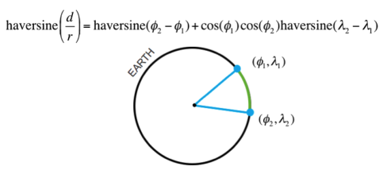

캐글(kaggle) 풀어하기
========================================================
author: Sang Yeol Lee
date: February 23 2018
width: 2600 
height: 3200
transition: linear
transition-speed: slow
autosize: false


- 일시 : 2018년 2월 24일, 시간 오후 3시20분 ~ 오후 5시50분
- 장소 : 한국Microsoft 11층(광화문 더케이트윈타워 A동)
- 링크 : https://kcd2018.festa.io/

========================================================


### 캐글뽀개기 스터디 : https://www.facebook.com/groups/kagglebreak

========================================================
<br>

| 발표 시간  | 튜토리얼 내용 | 
| :------------ | :-----------: | 
| 15:20 ~ 16:20    | (첫 번째 시간) 캐글 및 세팅
| 16:40 ~ 17:50   | (두 번째 시간) 문제 풀어보기 | 

- 이번 시간부터 캐글 문제 풀어보기가 진행될 예정입니다. 1. 데이터 전처리, 2. 탐색적 데이터 분석, 3. 머신러닝, 4. 제출 등입니다.

### 데이터 필드

- id : 각 출장의 고유 식별자
- vendor_id : 여행 기록과 연결된 공급자를 나타내는 코드
- pickup_datetime : 미터가 작동 된 날짜와 시간
- dropoff_datetime : 미터가 분리 된 날짜와 시간
- passenger_count : 차량의 승객 수 (운전자가 입력 한 값)
- pickup_longitude : 미터가 사용 된 경도
- pickup_latitude : 미터가 사용 된 위도
- dropoff_longitude : 미터가 분리 된 경도
- dropoff_latitude : 미터가 분리 된 위도
- store_and_fwd_flag : 플래그는 자동차가 서버에 연결되어 있지 않아 여행 기록이 차량 메모리에 보관되었는지 여부를 나타냅니다. 
  - Y = 저장 및 전달; N = 상점 및 순회 여행 불가

- trip_duration : 여행 기간 (초)

========================================================

## 1단계. 데이터 전처리


```r
#라이브러리 로딩
setwd("/home/kaggle/workspace/walkingkaggle/kcd2018")

require(DT)
require(tidyverse)
require(geosphere)
require(caret)
require(lubridate)

train = read_csv("./data/nyc-taxi-trip-duration/train.csv")
test = read_csv("./data/nyc-taxi-trip-duration/test.csv")

pick_coord <- train %>%
  select(pickup_longitude, pickup_latitude)
drop_coord <- train %>%
  select(dropoff_longitude, dropoff_latitude)
```


```r
train <- train %>%
  mutate(pickup_datetime = ymd_hms(pickup_datetime),
         pickup_months = month(pickup_datetime),
         pickup_week = week(pickup_datetime),
         pickup_yday = yday(pickup_datetime),
         pickup_wday = wday(pickup_datetime),
         pickup_day = day(pickup_datetime),
         pickup_hour = hour(pickup_datetime),
         pickup_min = minute(pickup_datetime),
         pickup_second = second(pickup_datetime),
          dropoff_longitude_outlier = ifelse(dropoff_longitude > quantile(dropoff_longitude, 0.95)[[1]], 1, 0),
         dropoff_latitude_outlier = ifelse(dropoff_longitude > quantile(dropoff_latitude, 0.95)[[1]], 1, 0),
         pickup_longitude_outlier = ifelse(dropoff_longitude > quantile(pickup_longitude, 0.95)[[1]], 1, 0),
         pickup_latitude_outlier = ifelse(dropoff_longitude > quantile(pickup_latitude, 0.95)[[1]], 1, 0)
)


train$dist_Cosine <- distCosine(pick_coord, drop_coord) 
train$dist_Haversine <- distHaversine(pick_coord, drop_coord) 
```

- 'haversine method'에 따라 두 점 사이의 최단 거리 (즉, '원 - 원 거리'). 해당 방법은 타원 효과를 무시하고 구형의 지구를 가정합니다.



========================================================


