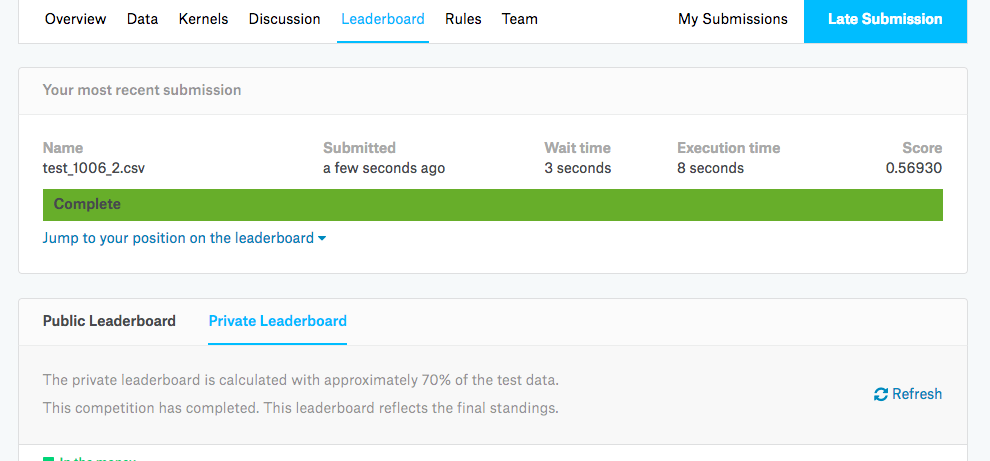
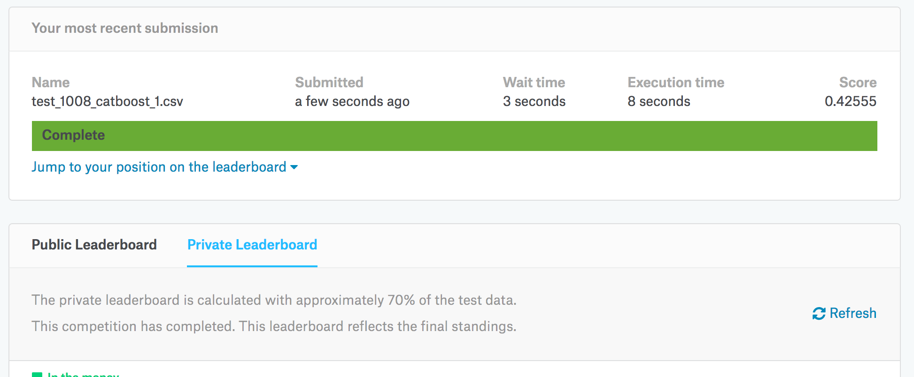

# 워킹캐글 소개
대회 : Taxi Kaggle 대회
참가자 : 이상열, 권윤환, 김강산, 민향숙, 엄진용, 홍선화

# 1.대회 소개
## New York City Taxi Trip Duration

- Kaggle은 뉴욕시에서 택시 여행의 총 주행 거리를 예측하는 모델을 만드는 것에 도전하고 있습니다. 

- 기본 데이터 세트는 픽업 시간, 지리적 좌표, 승객 수 및 기타 여러 변수가 포함 된 NYC 택시 및 리무진위원회에서 발급 한 데이터 세트입니다.


### 평가함수(Evalution)
- RMSLE(Root Mean Squared Logarithmic Error)
$$\epsilon = \sqrt{\frac{1}{n} \sum_{i=1}^n (\log(p_i + 1) - \log(a_i+1))^2 }$$

```
id,trip_duration
id00001,978
id00002,978
id00003,978
id00004,978
etc.
```

## 1단계. 데이터 전처리

```{r}
#라이브러리 로딩
library(tidyverse)
library(lubridate)
library(geosphere)
library(DT)
library(devtools)
library(ggplot2)
library(Metrics)
library(caret)
library(modelr)
library(xgboost)
library(catboost)
```

```{r, echo=FALSE}
rm(list=ls())

train = read_csv("./data/train.csv")
test = read_csv("./data/test.csv")

train <- train %>%
  mutate(pickup_datetime = ymd_hms(pickup_datetime),
         pickup_months = month(pickup_datetime),
         pickup_week = week(pickup_datetime),
         pickup_yday = yday(pickup_datetime),
         pickup_wday = wday(pickup_datetime),
         pickup_day = day(pickup_datetime),
         pickup_hour = hour(pickup_datetime),
         pickup_min = minute(pickup_datetime),
         pickup_second = second(pickup_datetime),
         pickup_week2 = ifelse(pickup_week==1 | pickup_week==7,"Weekend","not-Weekend"),
         dropoff_longitude_outlier = ifelse(dropoff_longitude > quantile(dropoff_longitude, 0.95)[[1]], 1, 0),
         dropoff_latitude_outlier = ifelse(dropoff_longitude > quantile(dropoff_latitude, 0.95)[[1]], 1, 0),
         pickup_longitude_outlier = ifelse(dropoff_longitude > quantile(pickup_longitude, 0.95)[[1]], 1, 0),
         pickup_latitude_outlier = ifelse(dropoff_longitude > quantile(pickup_latitude, 0.95)[[1]], 1, 0)
)

pick_coord <- train %>%
  select(pickup_longitude, pickup_latitude)
drop_coord <- train %>%
  select(dropoff_longitude, dropoff_latitude)

train$dist_Cosine <- distCosine(pick_coord, drop_coord) 
train$dist_Haversine <- distHaversine(pick_coord, drop_coord) 
train$dist_bearing <- bearing(pick_coord, drop_coord) 
train$dist_Meeus <- distMeeus(pick_coord, drop_coord) 
```

```{r}
train$log_trip_duration = log(train$trip_duration + 1)

transformdata = train %>% 
  select(-c(dropoff_datetime,
            pickup_datetime,id,
            trip_duration))

features <- colnames(transformdata)

for (f in features) {
  if ((class(transformdata[[f]])=="factor") || (class(transformdata[[f]])=="character")) {
    levels <- unique(transformdata[[f]])
    transformdata[[f]] <- as.numeric(factor(transformdata[[f]], levels=levels))
  }
}

test <- test %>%
  mutate(pickup_datetime = ymd_hms(pickup_datetime),
         pickup_months = month(pickup_datetime),
         pickup_week = week(pickup_datetime),
         pickup_yday = yday(pickup_datetime),
         pickup_wday = wday(pickup_datetime),
         pickup_day = day(pickup_datetime),
         pickup_hour = hour(pickup_datetime),
         pickup_min = minute(pickup_datetime),
         pickup_second = second(pickup_datetime),
         pickup_week2 = ifelse(pickup_week==1 | pickup_week==7,"Weekend","not-Weekend"),
         dropoff_longitude_outlier = ifelse(dropoff_longitude > quantile(dropoff_longitude, 0.95)[[1]], 1, 0),
         dropoff_latitude_outlier = ifelse(dropoff_longitude > quantile(dropoff_latitude, 0.95)[[1]], 1, 0),
         pickup_longitude_outlier = ifelse(dropoff_longitude > quantile(pickup_longitude, 0.95)[[1]], 1, 0),
         pickup_latitude_outlier = ifelse(dropoff_longitude > quantile(pickup_latitude, 0.95)[[1]], 1, 0)
  )

pick_coord <- test %>%
  select(pickup_longitude, pickup_latitude)
drop_coord <- test %>%
  select(dropoff_longitude, dropoff_latitude)

test$dist_Cosine <- distCosine(pick_coord, drop_coord) 
test$dist_Haversine <- distHaversine(pick_coord, drop_coord) 
test$dist_bearing <- bearing(pick_coord, drop_coord) 
test$dist_Meeus <- distMeeus(pick_coord, drop_coord) 

transformTest = test[,-1]

for (f in features) {
  if ((class(transformTest[[f]])=="factor") || (class(transformTest[[f]])=="character")) {
    levels <- unique(transformTest[[f]])
    transformTest[[f]] <- as.numeric(factor(transformTest[[f]], levels=levels))
  }
}
```

```{r}
runXGB <- function(train_X, train_y, test_X, test_y=NULL, feature_names=NULL, seed_val=0, num_rounds=100){
  param <- list()
  param['objective'] = 'reg:linear'
  param['eta'] = 0.01
  param['max_depth'] = 6
  param['silent'] = 1
  param['eval_metric'] = "rmse"
  param['min_child_weight'] = 1
  param['subsample'] = 0.7 # 70프로만 뽑겠다
  param['colsample_bytree'] = 0.7 # 변수 컬럼 비율
  param['seed'] = seed_val # 초기값 설정 랜덤 안되게
  #param['booster'] = 'gblinear'
  #param['lambda'] = 0.5
  #param['alpha '] = 0.5
  
  num_rounds = num_rounds
  
  
  plst = param
  xgtrain = xgb.DMatrix(data=train_X, label=train_y) 
  feature_names = dimnames(xgtrain)
  
  # test의 타겟값을 넣은 xgb model
  if (!is.null(test_y)){
    xgtest = xgb.DMatrix(data=test_X, label=test_y)
    watchlist = list('train'=xgtrain, 'test'=xgtest)
    model = xgb.train(params=plst, data=xgtrain, nrounds=num_rounds, watchlist=watchlist, early_stopping_rounds=20)
  }
  else{
    xgtest = xgb.DMatrix(test_X)
    model = xgb.train(plst, xgtrain, num_rounds)
  }
  pred_test_y = predict(model, xgtest)
  return(list(pred_test_y, model, feature_names))
}
```

```{r}
cv_scores = list()
train_df = transformdata %>% 
  select(-c(log_trip_duration))

train_y <- transformdata['log_trip_duration'] 

kf <- crossv_kfold(train_df, 5)

for (i in 1:5){
  dev_x <- as.matrix(train_df[kf$train[[i]]$idx,])
  val_x <- as.matrix(train_df[kf$test[[i]]$idx,])
  dev_y <- as.matrix(train_y[kf$train[[i]]$idx,])
  val_y <- as.matrix(train_y[kf$test[[i]]$idx,])
  results <- runXGB(dev_x, dev_y, val_x, val_y)
  print(results)
  cv_scores <- append(cv_scores, Metrics::rmse(actual = val_y, predicted = results[[1]]))
  print(cv_scores)
  break
}

cv_scores
```

```{r}
model_name = results[3][[1]][[2]]
importance = xgb.importance(model_name, model = results[[2]])

varImportance <- data.frame(Variables = importance$Feature, Gain = round(importance$Gain,2))
varImportance
# Create a rank variable based on importance
rankImportance <- varImportance %>%
  mutate(Rank = paste0('#',dense_rank(desc(Gain))))

fillColor = "#ff9999"

ggplot(rankImportance, aes(x = reorder(Variables, Gain), 
                           y = Gain)) +
  geom_bar(stat='identity',colour="white", fill = fillColor) +
  geom_text(aes(x = Variables, y = 1, label = Rank),
            hjust=0, vjust=.5, size = 2, colour = 'black',
            fontface = 'bold') +
  labs(x = 'Variables', title = '') +
  coord_flip() + 
  theme_bw()
```

### 1차 결과 (0.39535, xgboost 결과)


### 2차 결과 (0.56930, xgboost 결과, 중간 발표때 사용했던 위경도 사용 distance 등 변수 추가했을 경우 오버피팅)



```{r}
transformdata_df <- as.data.frame(transformdata) 

transformdata_df$vendor_id <- as.factor(transformdata_df$vendor_id)
transformdata_df$passenger_count <- as.factor(transformdata_df$passenger_count)
transformdata_df$store_and_fwd_flag <- as.factor(transformdata_df$store_and_fwd_flag)
transformdata_df$pickup_months <- as.factor(transformdata_df$pickup_months)
transformdata_df$pickup_wday <- as.factor(transformdata_df$pickup_wday)
transformdata_df$pickup_week2 <- as.factor(transformdata_df$pickup_week2)
transformdata_df$dropoff_longitude_outlier <- as.factor(transformdata_df$dropoff_longitude_outlier)
transformdata_df$dropoff_latitude_outlier <- as.factor(transformdata_df$dropoff_latitude_outlier)
transformdata_df$pickup_longitude_outlier <- as.factor(transformdata_df$pickup_longitude_outlier)
transformdata_df$pickup_latitude_outlier <- as.factor(transformdata_df$pickup_latitude_outlier)

transformTest_df <- as.data.frame(transformTest) 

transformTest_df$vendor_id <- as.factor(transformTest_df$vendor_id)
transformTest_df$passenger_count <- as.factor(transformTest_df$passenger_count)
transformTest_df$store_and_fwd_flag <- as.factor(transformTest_df$store_and_fwd_flag)
transformTest_df$pickup_months <- as.factor(transformTest_df$pickup_months)
transformTest_df$pickup_wday <- as.factor(transformTest_df$pickup_wday)
transformTest_df$pickup_week2 <- as.factor(transformTest_df$pickup_week2)
transformTest_df$dropoff_longitude_outlier <- as.factor(transformTest_df$dropoff_longitude_outlier)
transformTest_df$dropoff_latitude_outlier <- as.factor(transformTest_df$dropoff_latitude_outlier)
transformTest_df$pickup_longitude_outlier <- as.factor(transformTest_df$pickup_longitude_outlier)
transformTest_df$pickup_latitude_outlier <- as.factor(transformTest_df$pickup_latitude_outlier)


fit_control <- trainControl(method = "cv",
                            number = 2)

grid <- expand.grid(depth = c(4,8),
                    learning_rate = 0.01,
                    iterations = 10,
                    l2_leaf_reg = 0.1,
                    rsm = 0.95,
                    border_count = c(32,64))

model <- train(x=transformdata_df[,-25], y=transformdata_df[,25],
               method = catboost.caret,
               verbose = TRUE, preProc = NULL, metric='RMSE',
               tuneGrid = grid, trControl = fit_control)

print(model)
```

### 3차 결과 (0.4255, catboost 결과 /catboost 라이브러리 튜닝 못함)

- ref: https://catboost.yandex/

- example : https://github.com/catboost/catboost/blob/master/catboost/tutorials/catboost_r_tutorial.ipynb



