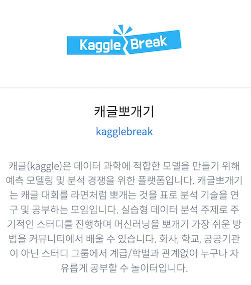

# JetBrians Day 서울 2018

## 워크샵 : 캐글뽀개기 소개 및 캐글 튜토리얼 같이 풀어보기

- 일시 : 2018년 11월 22일, 시간 오후 2시 ~ 오후 4시 45분
- 장소 : 세종대학교 컨벤션센터
- 링크 : [Jetbrains](https://info.jetbrains.com/jetbrains-day-seoul-2018.html)

## 캐글뽀개기 스터디 : https://www.facebook.com/groups/kagglebreak

========================================================
 

| 발표 시간  | 튜토리얼 내용 | 발표자료 |
| :------------ | :-----------: | :-----------: |
| 14:00 ~ 14:50   | (첫 번째 시간) 캐글 및 캐글뽀개기 소개|[발표자료]()|
| 14:50 ~ 15:10   | 쉬는 시간 + Q&A||
| 15:10 ~ 15:50   | (두 번째 시간) 타이타닉 문제 소개 및 R 문법 기초 |[발표자료](https://www.kaggle.com/syleeie/jetbrain-days-kr-2018-r-basic-kagglebreak?scriptVersionId=7604388)|
| 15:50 ~ 16:10   | 쉬는 시간 + Q&A||
| 16:10 ~ 16:45   | (세 번째 시간) 타이타닉 실습 시간|[발표자료](https://bit.ly/2A8uYhp)|

## 자료 링크
- 자료는 첫 번째 시간은 pdf이고, 두/세번째 시간은 캐글 Kernel 입니다. 링크 따라서 Fork 통해서 진행하시길 바랍니다. 
- 실습의 해당되는 코드는 bit.ly 링크를 통해 공유드립니다. github을 clone 또는 download 해주시면 됩니다.
